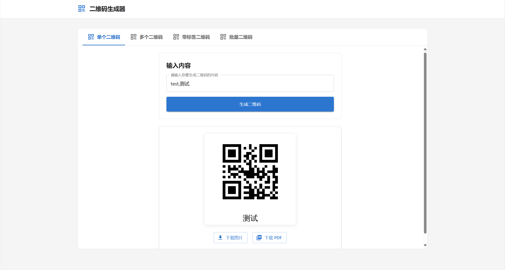

# 二维码生成器

一个现代化的二维码生成工具，支持单个和批量生成二维码，提供完整的前后端。

## 功能特性

### 二维码生成

- ✨ 单个二维码生成
  - 自定义二维码尺寸和样式
  - 支持添加自定义标签文本
  - 实时预览生成效果
  - 支持下载二维码图片和 PDF
  
- 📦 批量生成
  - Excel/CSV 文件批量处理
  - 支持多行文本粘贴处理
  - 表格数据预览和编辑
  - 支持为每个二维码添加不同标签
  - 详细的使用说明指导
  - 支持下载单个图片或整页 PDF

### 文件处理

- 支持 Excel(.xlsx, .xls) 和 CSV 格式
- 可视化配置内容列和标签列
- 数据预处理和验证
- 表格数据支持搜索、排序和编辑
- 支持键盘导航和快速预览
- 数据编辑支持撤销/重做

### 导出功能

- 单个二维码图片下载
- 批量 PDF 导出，包含所有二维码
- 支持在预览时直接下载
- 支持在表格中快速下载单个二维码

### 用户体验

- 详细的使用说明和引导
- 完整的键盘操作支持
- 实时预览和编辑功能
- 友好的错误提示
- 响应式设计，支持多种设备

## 项目展示

- 主页
  
- 使用说明
  
- 二维码展示页
  
  
  
  
  
  

## 开发环境要求

### 后端要求

- Python 3.12+
- 2GB+ RAM
- 1GB+ 磁盘空间
- 支持 Windows/Linux/macOS

### 前端要求

- Node.js 19
- TypeScript 5.x
- Next.js 15.x
- Material UI 6.x

## 项目结构

```text
├── frontend/                # 前端项目
│   ├── app/                # Next.js 应用
│   │   ├── components/     # 可复用组件
│   │   ├── hooks/         # 自定义 Hooks
│   │   ├── services/      # API 服务
│   │   └── theme/         # 主题配置
│   └── package.json
│
├── backend/                # 后端项目
│   ├── app/               # 主应用目录
│   │   ├── services/      # 核心服务
│   │   └── utils/         # 工具函数
│   ├── temp/             # 临时文件
│   └── logs/             # 日志文件
│
└── README.md
```

## 部署说明

### 后端部署

1. 创建并激活虚拟环境：

```bash
# Windows
python -m venv venv
.\venv\Scripts\activate

# Linux/macOS
python3 -m venv venv
source venv/bin/activate
```

2. 安装依赖：

```bash
cd backend
pip install -r requirements.txt
```

3. 配置环境变量：
   - 复制 `.env.example` 为 `.env`
   - 根据需要修改配置

4. 启动服务：

```bash
python run.py
```

### 前端部署

1. 安装依赖：

```bash
cd frontend
npm install
```

2. 配置环境变量：
   - 创建 `.env.development` 文件
   - 设置 `NEXT_PUBLIC_API_URL=你的后端API地址`

3. 开发环境运行：

```bash
npm run dev
```

4. 生产环境构建：

```bash
npm run build
npm start
```

## 访问服务

- 前端访问：`http://localhost:3000`
- 后端API文档：`http://localhost:8000/docs`
- 交互式API文档：`http://localhost:8000/redoc`

## 联系方式

- 邮箱：`lijianqiao2906@live.com`
